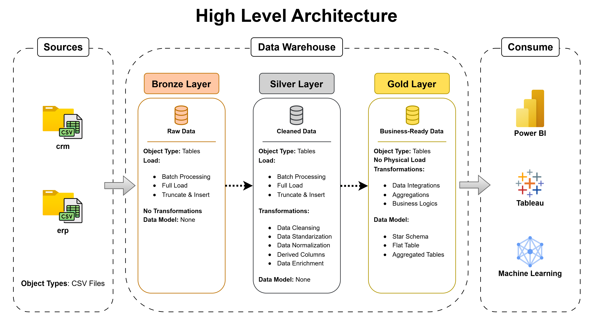

# SQL Data Warehouse Project

Welcome to the **SQL Data Warehouse Project** repository! 🚀  
This project demonstrates a comprehensive data warehousing solution built with SQL Server, showcasing industry best practices in data engineering, ETL pipelines, and data analytics. Designed as a portfolio project, it highlights modern approaches to data architecture and warehousing.

---

## 🏗️ Data Architecture

The data architecture for this project follows the **Medallion Architecture** pattern with three distinct layers:



1. **Bronze Layer**: Stores raw data as-is from source systems. Data is ingested from CSV files directly into SQL Server without any transformation.
2. **Silver Layer**: Implements data cleansing, standardization, validation, and normalization processes to prepare high-quality data for analysis.
3. **Gold Layer**: Houses business-ready data modeled into a star schema, optimized for reporting, analytics, and business intelligence applications.

---

## 📖 Project Overview

This comprehensive data warehousing project encompasses:

1. **Data Architecture Design**: Modern data warehouse implementation using Medallion Architecture with Bronze, Silver, and Gold layers.
2. **ETL Pipelines**: Complete extraction, transformation, and loading processes from source systems into the warehouse.
3. **Data Modeling**: Development of fact and dimension tables optimized for analytical queries and reporting.
4. **Data Quality**: Implementation of data validation, cleansing, and quality assurance mechanisms.
5. **Analytics & Reporting**: SQL-based analytics and reports delivering actionable business insights.

🎯 This repository demonstrates expertise in:
- SQL Server Development
- Data Architecture & Design
- ETL Pipeline Development
- Data Modeling & Star Schema Design
- Data Quality & Governance
- Data Analytics & Business Intelligence

---

## 🛠️ Tools & Resources

Everything is accessible and free!

- **[SQL Server Express](https://www.microsoft.com/en-us/sql-server/sql-server-downloads)**: Lightweight SQL Server edition for database hosting.
- **[SQL Server Management Studio (SSMS)](https://learn.microsoft.com/en-us/sql/ssms/download-sql-server-management-studio-ssms?view=sql-server-ver16)**: GUI tool for database management and SQL development.
- **[Git & GitHub](https://github.com/)**: Version control and repository management.
- **[DrawIO](https://www.drawio.com/)**: Design data architecture diagrams, data flows, and models.
- **[Notion](https://www.notion.com/)**: Project management and documentation organization.
- **[Datasets](datasets/)**: Access to project dataset CSV files from source systems.

---

## 🚀 Project Requirements

### Building the Data Warehouse (Data Engineering)

#### Objective
Develop a modern data warehouse using SQL Server to consolidate data from multiple source systems, enabling comprehensive analytical reporting and data-driven decision-making.

#### Specifications
- **Data Sources**: Import data from multiple source systems (ERP, CRM, etc.) provided as CSV files.
- **Data Quality**: Implement comprehensive data cleansing and quality validation prior to analysis.
- **Integration**: Combine multiple sources into a unified, analytically-optimized data model.
- **Scope**: Focus on current dataset; historical data tracking not required for initial implementation.
- **Documentation**: Provide detailed documentation of the data model for business stakeholders and analytics teams.

---

### Analytics & Reporting

#### Objective
Develop SQL-based analytics to deliver actionable insights into:
- **Customer Behavior & Segmentation**
- **Product Performance & Trends**
- **Sales Analysis & Revenue Metrics**
- **Operational Efficiency Metrics**

These insights enable stakeholders to make strategic, data-driven business decisions.

For detailed requirements, refer to [docs/requirements.md](docs/requirements.md).

---

## 📂 Repository Structure

```
sql-data-warehouse-project/
│
├── datasets/                           # Raw datasets from source systems (CSV files)
│   ├── erp_data/                       # ERP system data
│   └── crm_data/                       # CRM system data
│
├── docs/                               # Project documentation and architecture
│   ├── data_architecture.drawio        # Medallion architecture diagram
│   ├── data_architecture.png           # Architecture visualization
│   ├── etl.drawio                      # ETL techniques and methods
│   ├── data_flow.drawio                # Data flow diagrams
│   ├── data_models.drawio              # Star schema and data models
│   ├── data_catalog.md                 # Field descriptions and metadata
│   ├── naming-conventions.md           # Naming guidelines for objects
│   └── requirements.md                 # Detailed project requirements
│
├── scripts/                            # SQL scripts organized by layer
│   ├── bronze/                         # Raw data loading scripts
│   │   ├── 01_create_bronze_schema.sql
│   │   ├── 02_load_erp_data.sql
│   │   └── 03_load_crm_data.sql
│   │
│   ├── silver/                         # Data transformation & cleansing
│   │   ├── 01_create_silver_schema.sql
│   │   ├── 02_clean_customer_data.sql
│   │   ├── 03_clean_product_data.sql
│   │   └── 04_clean_sales_data.sql
│   │
│   └── gold/                           # Analytical models & reporting
│       ├── 01_create_gold_schema.sql
│       ├── 02_create_dim_customer.sql
│       ├── 03_create_dim_product.sql
│       ├── 04_create_fact_sales.sql
│       └── 05_create_analytics_views.sql
│
├── tests/                              # Data quality tests and validation scripts
│   ├── test_data_completeness.sql
│   ├── test_data_accuracy.sql
│   └── test_data_consistency.sql
│
├── README.md                           # Project overview and setup instructions
├── LICENSE                             # MIT License
├── .gitignore                          # Git ignore rules
└── requirements.txt                    # Project dependencies and versions
```

---

## 🚀 Getting Started

### Prerequisites
- SQL Server 2019 or higher (Express edition works fine)
- SQL Server Management Studio (SSMS)
- Git
- Basic SQL knowledge

### Setup Instructions

1. **Clone the repository**
   ```bash
   git clone https://github.com/mohamed-asm1/sql-data-warehouse-project.git
   cd sql-data-warehouse-project
   ```

2. **Prepare your environment**
   - Install SQL Server and SSMS if not already installed
   - Create a new database in your SQL Server instance

3. **Execute scripts in order**
   - Start with Bronze layer scripts to load raw data
   - Follow with Silver layer scripts for data cleaning
   - Complete with Gold layer scripts for analytical models

4. **Validate data quality**
   - Run test scripts to ensure data integrity
   - Review data quality reports

---

## 📊 Key Features

✅ **Medallion Architecture**: Clean separation of concerns across Bronze, Silver, and Gold layers  
✅ **Data Quality Framework**: Comprehensive validation and cleansing processes  
✅ **Star Schema Design**: Optimized dimensional model for analytics  
✅ **Scalable ETL**: Modular scripts supporting future data source additions  
✅ **Documentation**: Complete technical and business documentation  
✅ **Best Practices**: Industry-standard naming conventions and coding standards  

---

## 🎓 About This Project

This project was developed as part of my data engineering studies at the **National School of Applied Sciences of Al Hoceima** (ENSA Al Hoceima). It represents practical application of modern data warehousing principles, demonstrating proficiency in:

- Designing enterprise data architectures
- Developing ETL pipelines
- Creating analytics-ready data models
- Writing production-quality SQL code
- Documenting complex data systems

---

## 🛡️ License

This project is licensed under the [MIT License](LICENSE). You are free to use, modify, and share this project with proper attribution.

---

## 📧 Contact & Social Media

Feel free to reach out and connect with me on the following platforms:

[](https://linkedin.com/in/mohamed-aasoum)
[](https://github.com/mohamed-asm1)
[](mailto:your-email@example.com)

---

## 🙏 Acknowledgments

This project follows industry best practices in data warehousing and draws inspiration from modern data engineering methodologies. Thanks to the open-source community and all resources that made this learning journey possible.

**Happy Learning! 🚀**
